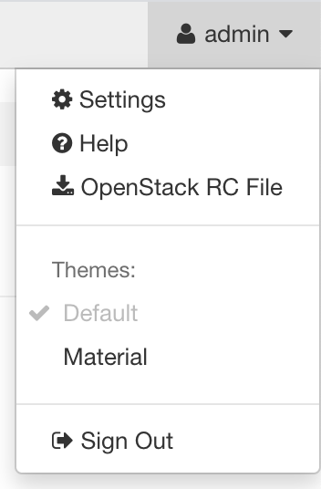

.. include:: vars.rst

==================
Access to Services
==================

Openstack Services
==================

Accessing to Horizon
--------------------

The OpenStack web UI is available at: |horizon_url|

This site is accessible |horizon_access|.

Accessing the OpenStack CLI
---------------------------

A simple way to get started with accessing the OpenStack command-line
interface.

This can be done from |public_api_access_host| (for example), or any machine
that has access to |public_vip|:

.. code-block:: console

 openstack# python3 -m venv openstack-venv
 openstack# source openstack-venv/bin/activate
 openstack# pip install -U pip
 openstack# pip install python-openstackclient
 openstack# source <project>-openrc.sh

The `<project>-openrc.sh` file can be downloaded from the OpenStack Dashboard
(Horizon):

Now it should be possible to run OpenStack commands:

.. code-block:: console

 openstack# openstack server list

Accessing Deployed Instances
----------------------------

The external network of OpenStack, called |public_network|, connects to the
subnet |public_subnet|. This network is accessible |floating_ip_access|.

Any OpenStack instance can make outgoing connections to this network, via a
router that connects the internal network of the project to the
|public_network| network.

To enable incoming connections (e.g. SSH), a floating IP is required. A
floating IP is allocated and associated via OpenStack. Security groups must be
set to permit the kind of connectivity required (i.e. to define the ports that
must be opened).

Monitoring Services
===================

Access to Opensearch Dashboard
------------------------------

OpenStack control plane logs are aggregated from all servers by Fluentd and
stored in OpenSearch. The control plane logs can be accessed from
OpenSearch using Opensearch Dashboard, which is available at the following URL:
|opensearch_dashboard_url|

To log in, use the ``opensearch`` user. The password is auto-generated by
Kolla-Ansible and can be extracted from the encrypted passwords file
(|kolla_passwords|):

.. code-block:: console
   :substitutions:

   kayobe# ansible-vault view ${KAYOBE_CONFIG_PATH}/kolla/passwords.yml --vault-password-file |vault_password_file_path| | grep ^opensearch

Access to Grafana
-----------------

Control plane metrics can be visualised in Grafana dashboards. Grafana can be
found at the following address: |grafana_url|

To log in, use the |grafana_username| user. The password is auto-generated by
Kolla-Ansible and can be extracted from the encrypted passwords file
(|kolla_passwords|):

.. code-block:: console
   :substitutions:

   kayobe# ansible-vault view ${KAYOBE_CONFIG_PATH}/kolla/passwords.yml --vault-password-file |vault_password_file_path| | grep ^grafana_admin_password

.. _prometheus-alertmanager:

Access to Prometheus Alertmanager
---------------------------------

Control plane alerts can be visualised and managed in Alertmanager, which can
be found at the following address: |alertmanager_url|

To log in, use the ``admin`` user. The password is auto-generated by
Kolla-Ansible and can be extracted from the encrypted passwords file
(|kolla_passwords|):

.. code-block:: console
   :substitutions:

   kayobe# ansible-vault view ${KAYOBE_CONFIG_PATH}/kolla/passwords.yml --vault-password-file |vault_password_file_path| | grep ^prometheus_alertmanager_password

.. ifconfig:: deployment['wazuh']

   Access to Wazuh Manager
   -----------------------

   To access the Wazuh Manager dashboard, navigate to the ip address
   of |wazuh_manager_name| (|wazuh_manager_url|).

   You can login to the dashboard with the username ``admin``.  The
   password for ``admin`` is defined in the secret
   ``opendistro_admin_password`` which can be found within
   ``etc/kayobe/inventory/group_vars/wazuh-manager/wazuh-secrets.yml``.

   .. note:: Use ``ansible-vault`` to view Wazuh secrets:
      :substitutions:

   ``ansible-vault view --vault-password-file |vault_password_file_path| $KAYOBE_CONFIG_PATH/inventory/group_vars/wazuh-manager/wazuh-secrets.yml``
